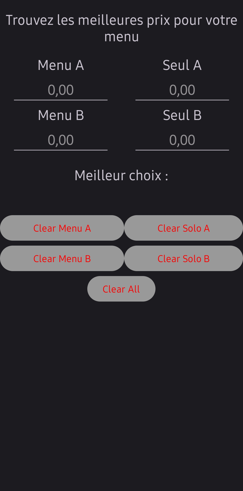
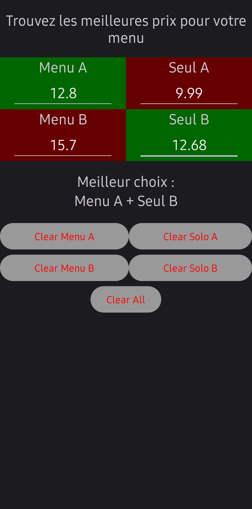
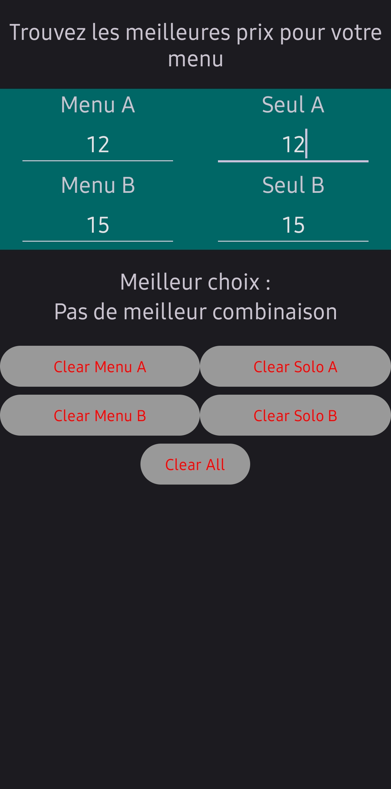

# CrossPrices

Application permettant de trouver la meilleure association de prix pour composer son menu de façon la moins chère possible.

C'est une problématique que j'avais avec mon frère : Dans les fast-foods, un menu c'est trop peu, 2 menus c'est trop, donc il nous faut 1 menu + un burger seul.
Avec cette application très archaïque, il est possible de savoir s'il vaut mieux prendre le burger A en menu et le B seul, ou l'inverse, pour payer le moins possible.

